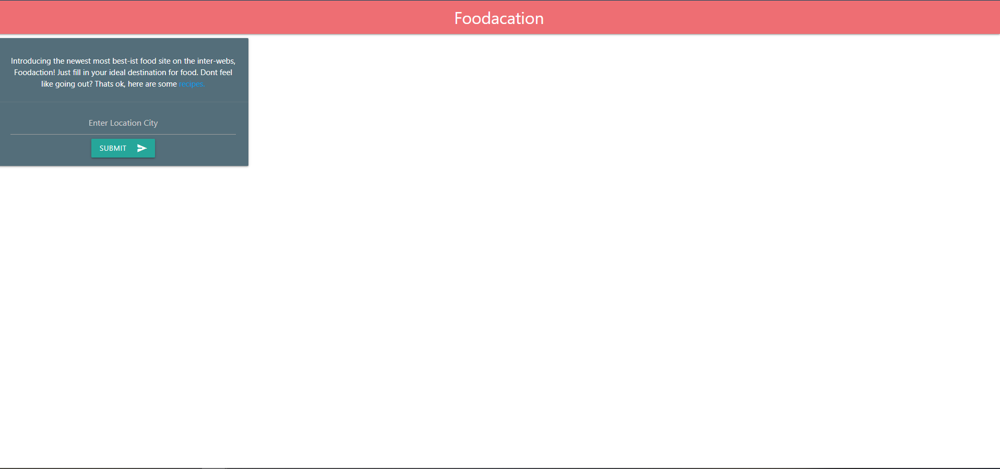
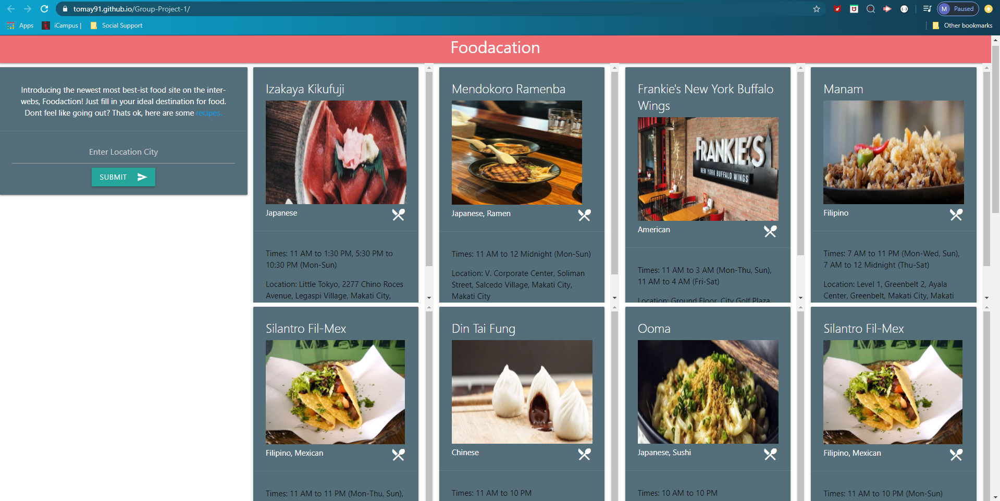

# Foodication

Creating an application that looks up restaurants according to your area. Or recipes according to your preference. 

The user will enter a city and get info on Restaurants or they can navigate to get recipes and search by the type of food.

# User Story
AS a USER 
I WANT to look for receipes if I want to eat in or search nearby resturants.
So that I can have easy access to food options when on vaction.

# Concept & Motivation

* Concept: To make a site that combines Restaurants and Recipe info.
* Motivation: To streamline the process of deciding whether to eat in or dine out. 

# Technologies

* Zomato API

* Spoonacular API

* CSS, HTML, JQuery.

* Materialize

# Future Improvement

* Add new API’s involving Food

* Add more styling (seamless and sleek)

* Add additional information on food (calorie info)

# Project Review

* Deployed Version: https://tomay91.github.io/Foodacation-Project-1/

* Github: https://github.com/tomay91/Group-Project-1

* The following image demonstrates the application functionality:

# Project Team

# Contact Information

Malesha Jones

* Github: [Jones-M12](https://github.com/Jones-M12) 

* Email: malesharj@gmail.com 

* LindedIn: [m-jones89](https://www.linkedin.com/in/m-jones89/)

Travis Lovingood

* Github: [TravisLovingood](https://github.com/TravisLovingood) 

* Email: tclovingood01@gmail.com 

* LindedIn: [travis-lovingood-8868101a7](https://www.linkedin.com/in/travis-lovingood-8868101a7/)

Thomas O'Connell

* Github: [tomay19](https://github.com/TravisLovingood) 

* Email: tomay91@gmail.com

* LindedIn: [thomas-fiore-o-connell-9958a721](https://www.linkedin.com/in/thomas-fiore-o-connell-9958a721/)

Dilshan Opatha

* Github: [dopatha2020](https://github.com/dopatha2020) 

* Email: dopatha@nc.rr.com

* LindedIn: [dilshan-opatha-266b191b5](https://www.linkedin.com/in/dilshan-opatha-266b191b5/)

